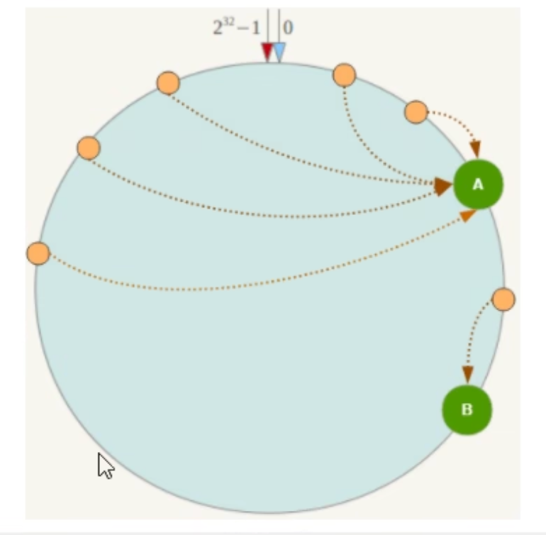

**面试问题：**

1-2亿条数据需要缓存，请问如何设计这个存储案例

**回答：**

单机单台不可能，肯定是分布式存储，用 redis 如何落地。一般业界有3种解决方案，*哈希取余分区，一致性哈希算法分区，哈希槽分区*

# 哈希取余分区
**定义：**

假设有3台机器构成一个集群，用户每次读写操作都是根据公式：hash(key)%N 个机器台数，计算出哈希值，用来决定数据映射到哪一个节点上。

**优点：**

简单粗暴，直接有效，只需要预估好数据规划好节点，例如：3台、8台、10台，就能保证一段时间的数据支撑。使用 hash 算法让固定的一部分请求落到同一台服务器上，这样每台服务器固定处理一部分请求（并维护这些请求的信息），起到负载均衡+分而治之的作用

**缺点：**

原来规划好的节点，进行扩容或者缩容就比较麻烦了。当扩容或缩容时，取模公式发生了变化：hash(key)/3 变成 hash(key)/?。而原先的数据还在 hash(key)/3 的取模中，当使用新的公式时，就难以找到原来的数据

# 一致性哈希算法
**定义**

哈希值的范围是 0～2的32次方。

1. 我们定义一个0～2的32次方数组成虚拟的圆环。让服务器的ip节点通过 
2. hash 生成一个值，这个值在圆环上。
3. 首先计算 key 的 hash值，这个hash值就是圆环上的key位置，从此位置沿着环顺时针走，遇到的第一个服务器就是其定位到的服务器。

**优点**

1. 一致性哈希算法的容错性高。
2. 一致性哈希算法的扩展性好。

因为key 遇到的第一个服务器就是存储数据的服务器，因此当服务器损坏时，只有这一个服务器的 key 需要重新计算

**缺点**

当服务器数量只有两个时，并且两个服务器在圆环的位置比较近时，容易导致其中一个服务器负载过重（数据倾斜）

# 哈希槽分区

**定义**

